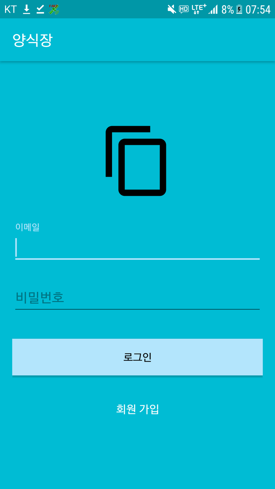
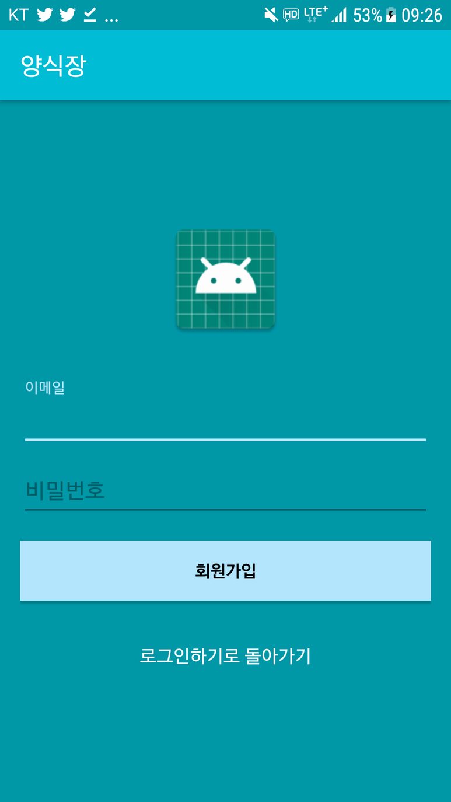
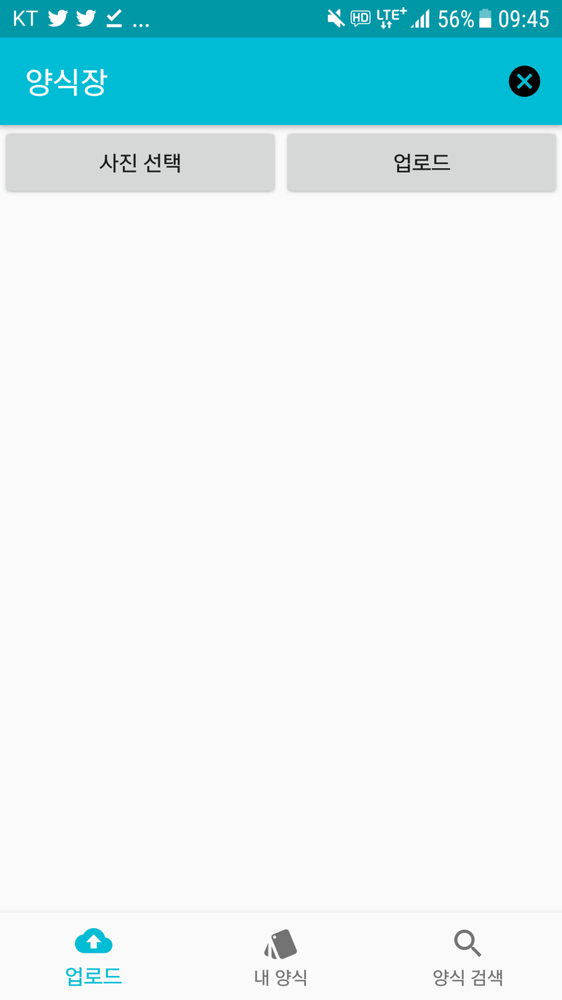
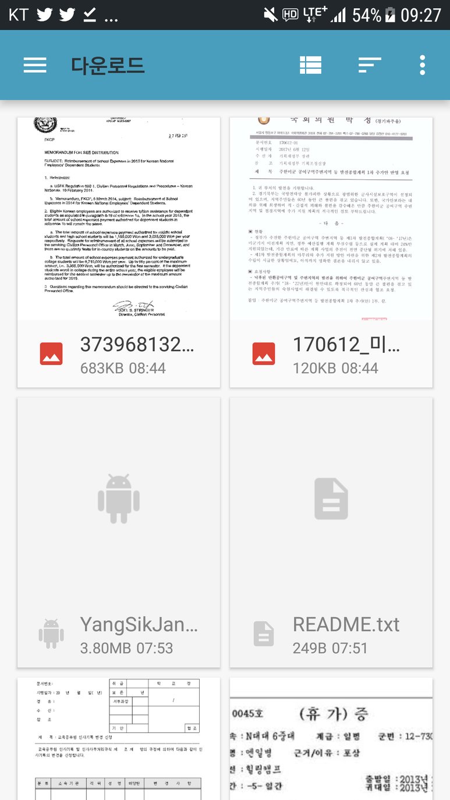
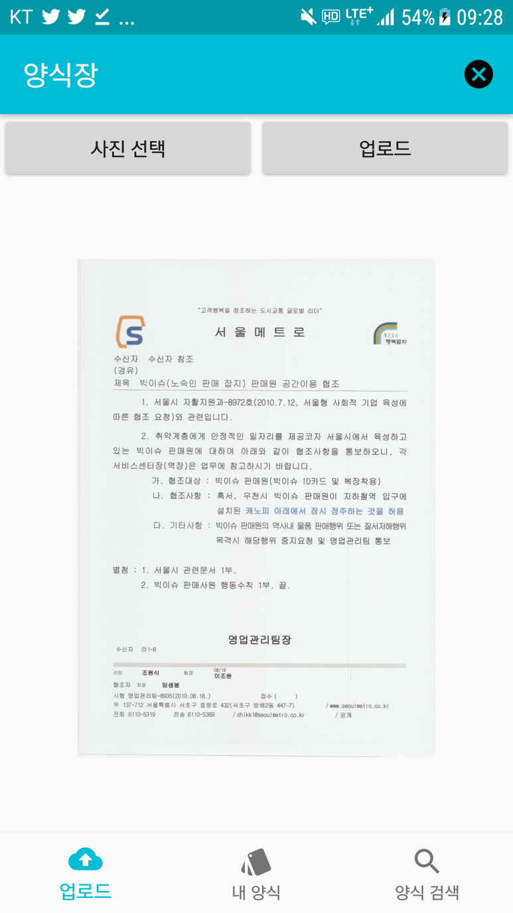
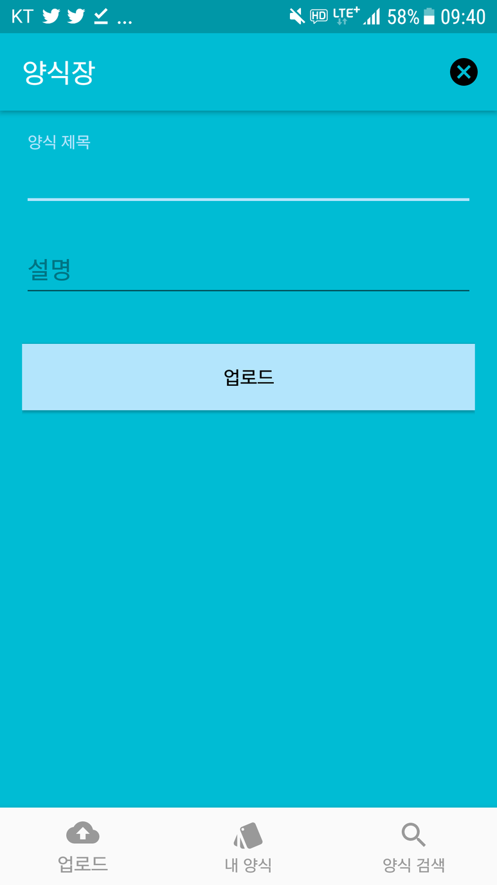
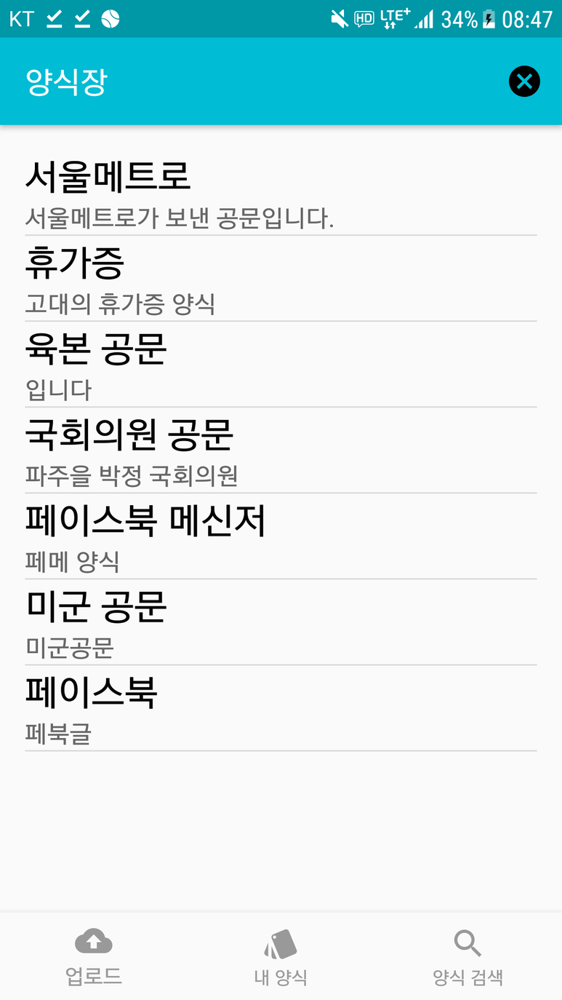
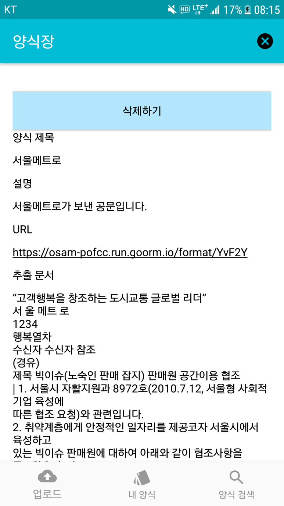
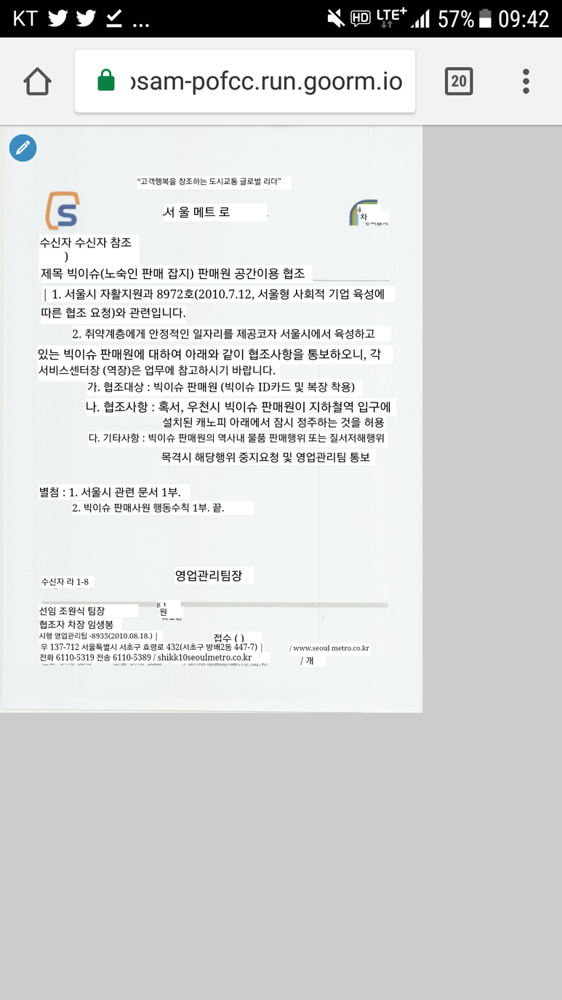
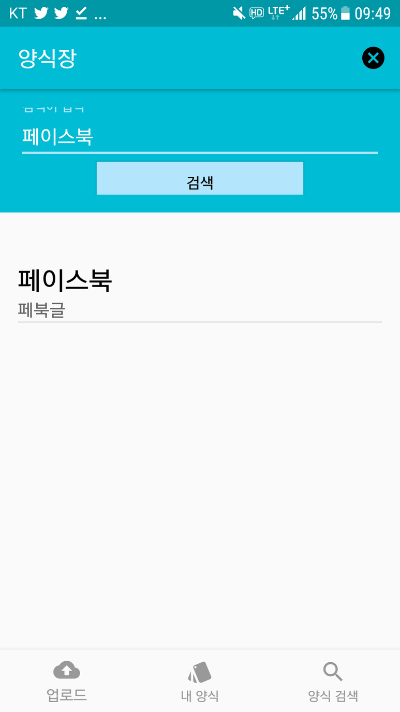

# 양식장

## 이미지를 인식해 자동으로 양식(format)으로 바꾸고 내용을 추출하는 앱

제작자 : 일병 이수재

## 소개
 검열기간이 되면 부대는 문서를 준비하느라 분주해집니다. 혹시라도 필요한 양식이 있는데 컴퓨터에 없을때면, 행정병들은 자를 들고 부랴부랴 양식을 만들기 시작합니다. 때론 완전히 새로운 양식을 만들어야 할때도 있습니다. 그럴때면 옆 부대는 어떻게 양식을 만들었는지, 그걸 갖다 쓸 수는 없는지가 궁금하지만 이제까지 병사들은  다시 조용히 자를 들고 양식을 만들어야만 했습니다. 이 앱은 그런 불편함을 덜어주기 위해 만들어진 앱입니다. 새로 양식을 만들 필요 없이, 이미지만 업로드 하면 서버에서 자동으로 OCR처리를 하여 '양식화'하여 글 부분을 수정할 수 있게 바꿔 줍니다. 그 양식들은 내 양식에 저장되고, 공유되어 다른 사람들의 양식을 볼 수도 있습니다. OCR처리한 내용만 따로 빼내어 문서의 글 부분만 볼 수도 있습니다. 

## 활용성
  우선 이미지로부터 문서의 양식을 만드는 귀찮은 일로부터 해방시켜 줍니다. 길이를 재고 열심히 타이핑을 치고 할 필요 없이 단순히 사진을 찍은 뒤 이미지를 올리면 됩니다. 어떤 양식이 적절할 지 모를때도 양식장의 양식 검색 기능을 통해서 다른 사람들이 사용한 양식을 보면 됩니다. 지나가다, 혹은 인터넷에서 맘에 드는 양식을 얻었을 때 앱을 키면 바로 양식을 얻을 수 있습니다.
  
  
  또한 양식을 표준화시켜주는 기능이 있습니다. 같은 역할을 하기 위한 양식인데도, 부대마다 다른 양식들이 있습니다. 굳이 군대에 국한된 얘기가 아닙니다. 이 앱을 쓰게 된다면 중복된 양식을 사용하는 일도 사라질 것입니다.
  
  
  또한 양식장은 데이터 분석을 용이하게 해 줄 것입니다. 최근 빅데이터와 AI가 급 부상하며 데이터의 중요성은 커져만 가고 있는데 양식으로부터 데이터를 얻는 과정은 문서의 내용과 문서의 틀이 섞여 있어서 거의 불가능에 가까웠습니다. 이를 해결하기 위해 복잡하게 타이핑을 치거나 인력을 쓰지 않고 단순히 양식장을 켜서 양식 이미지를 올리면 됩니다. 문서 파일을 잃어버렸거나, 내가 문서 파일을 구할 수 없는 양식들 모두 걱정없이 사진만 찍어서 이미지를 올리면 됩니다.
  

## 기능 설명
앱에 존재하는 기능들을 설명하겠습니다. 

 

회원 가입과 로그인

firebase의 auth 기능을 이용하여 이메일과 비밀번호를 통해 회원가입과 로그인을 할 수 있습니다. 로그인이 되면 auth가 유지되기 때문에 앱을 본격적으로 사용할 수 있습니다.

  

이미지 선택

로그인 이후 앱의 초기 화면입니다. 업로드할 이미지를 선택하고, 그 이미지의 모습을 이미지뷰에 보여줍니다.

이미지 업로드

이미지 업로드 버튼을 선택하면 나오는 화면입니다. 이미지의 제목과 내용을 설정할 수 있습니다. 이후 업로드를 하면 그 정보들과 유저의 ID가 같이 DB에 저장하게 됩니다. 
이후 앱은 GET request를 ${serverURL}/process/:imageID 로 보내게 되어 이미지의 처리를 시작할 수 있게 합니다. GET request를 받은 node 페이지는 업로드된 이미지를 google cloud vision에 올리고 결과값을 코드로 바꿔줍니다.

내 양식

내가 가지고 있는 양식을 모두 보여주는 화면입니다. DB로부터 유저의 ID와 현재 Auth상의 ID가 같은 양식만 보여주게 됩니다.

개별 양식

양식을 선택했을 때 나오는 화면입니다. 양식을 삭제하거나 양식의 제목 및 내용, 추출된 텍스트를 볼 수 있습니다. URL을 클릭하면 양식을 수정할 수 있는 페이지인 /format/:formatID로 넘어갑니다. URL로 구성했기 때문에 앱 뿐만이 아닌 컴퓨터로도 접근 가능하여 훨씬 더 수월하게 수정을 할 수 있습니다.

  
URL을 클릭하면 다음과 같이 웹 페이지가 뜨며, 왼쪽 위의 펜 화면을 통해 수정할 수 있는 것을 볼 수 있습니다. 

 
양식 검색

양식을 검색할 수 있는 화면입니다. 서버에 올라온 모든 양식들을 볼 수 있으며, 제목을 검색하여 제목이 같은 양식을 찾아낼 수 있습니다.

## 기술 설명
유저 등록/로그인 처리 및 파일 저장, 데이터베이스 등은 Google의 Firebase을 활용해 개발을 용이하고 확장성있게 하였습니다. 
node.js 와 express.js를 이용하여 이미지의 업로드 감지 및 데이터 베이스 접근, 수정을 하였고 Goopgle의 CloudVision을 이용해 OCR 처리를 하였습니다. 
이후 처리된 OCR은 json 객체로 반환되어 오는데 이를 parsing하여 html 내에 적절한 위치로 바꿔주었고,
라이브러리는 textFill.js를 이용해 텍스트들이 제대로 보이게 하고 contentTools.js를 이용해 이를 수정 가능하게 하였습니다. 
그리고 이 페이지는 다시 node.js와 express.js를 이용해 serve 하고 있습니다.
이때 저의 접근할 수 있는 URL은 https://osam-pofcc.run.goorm.io 입니다. 이 URL을 통해 웹으로도 양식에 접근 및 수정할 수 있습니다.
마지막으로 구름IDE의 '항상 켜두기' 기능을 이용해 서버를 호스팅을 하고 있습니다.

## 사용 방법
  첨부된 apk는 제 서버로 세팅되어 있는 것으로 저장시 바로 사용할 수 있습니다. 직접 서버를 구성하고 앱을 사용하길 원하신다면 먼저 [파이어 베이스 등록하기](https://firebase.google.com/docs/auth/
 'backend')를 읽어서 credential과 각자의 앱을 firebase에서 세팅해주어야 합니다. 이후 받은 credentials.json을 backend로 옮겨 준 후 자신이 호스팅하고 있는 URL을 https://osam-pofcc.run.goorm.io/를 대신하여  node.js 와 앱 내에 세팅해 주어야 합니다.
 그리고 "node start.js" 명령을 통해 서버를 실행시켜 주면 백엔드 서버가 작동하게 됩니다.

